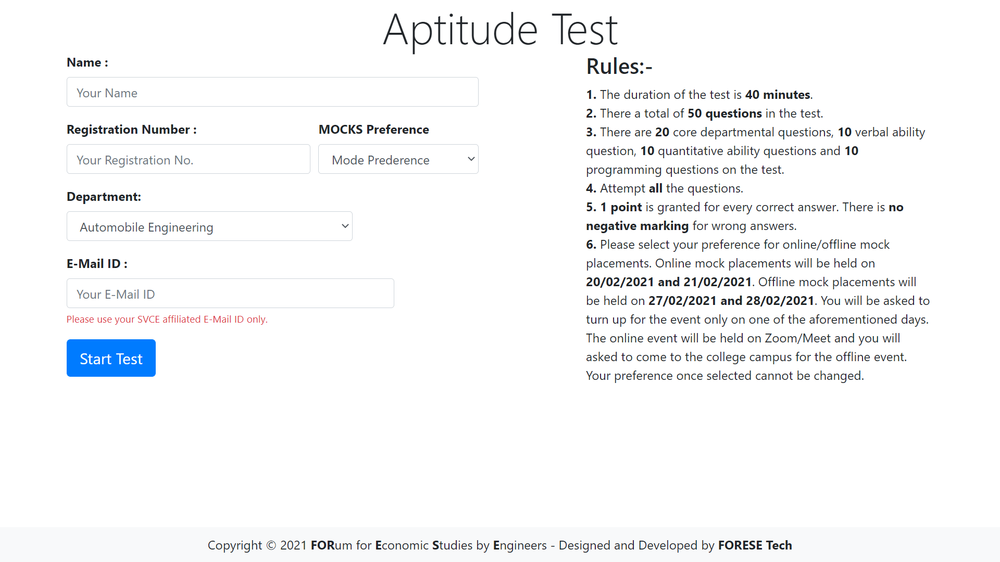
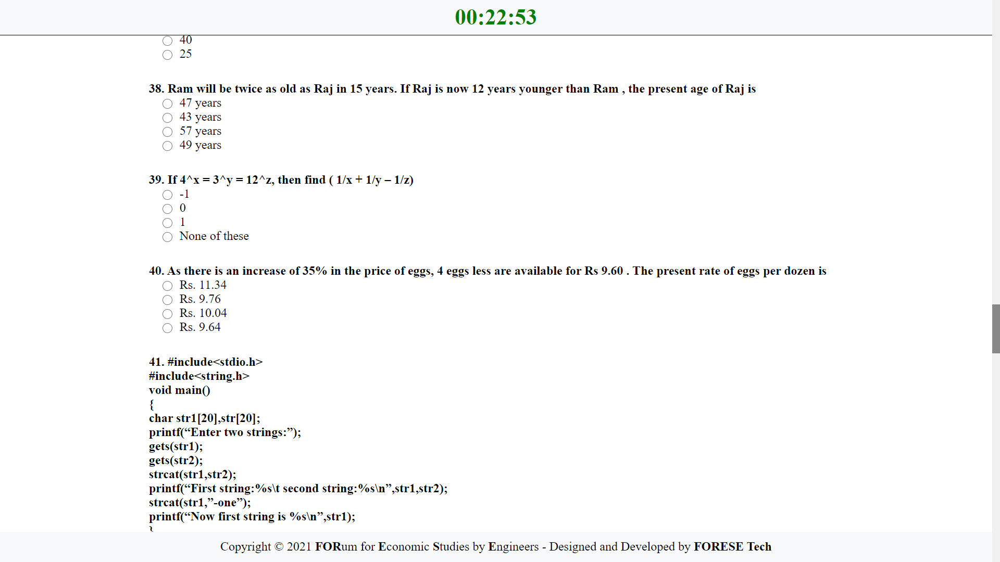
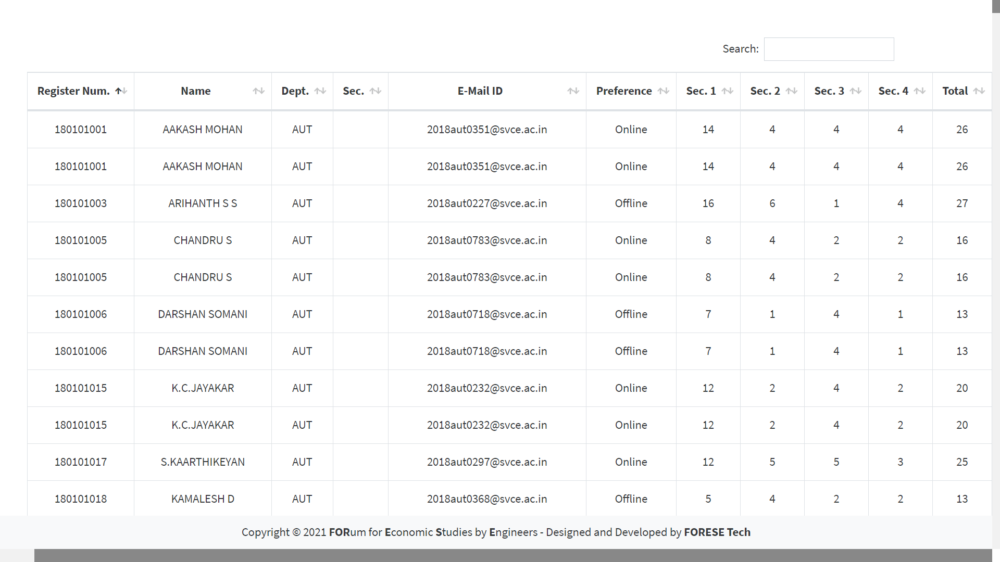
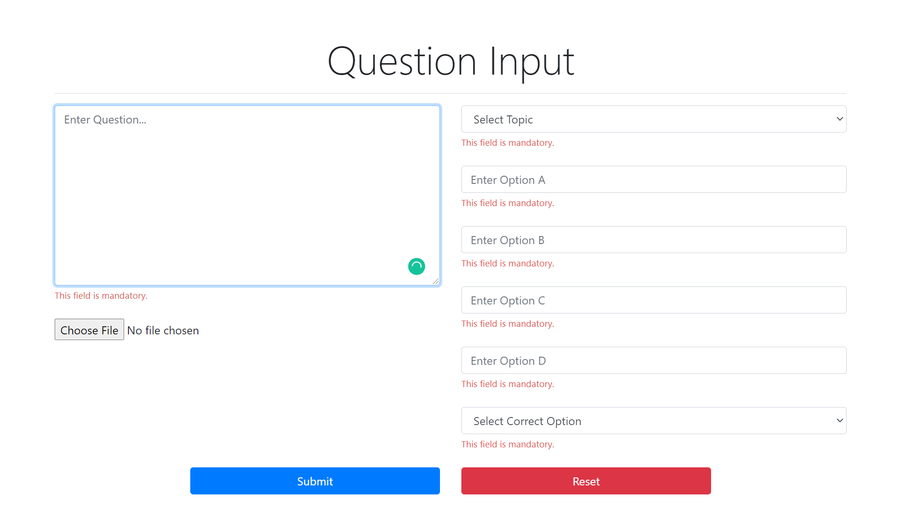
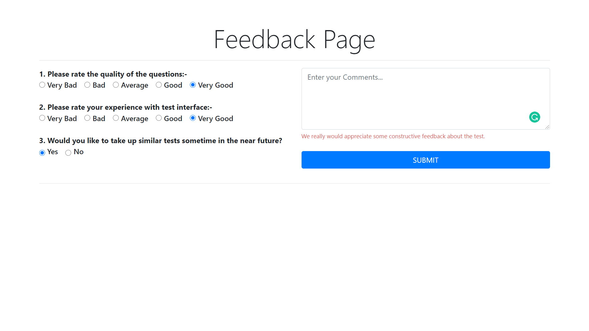
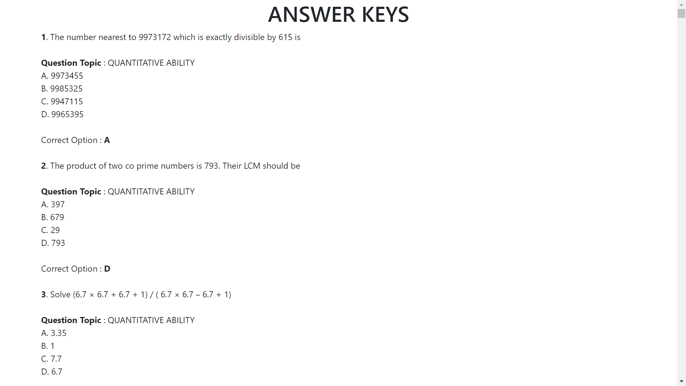

# AptitudeTestSoftware

LAMP Application to conduct mock aptitude tests at SVCE.

Complete with **user authentication, automatic result evaluation, attendance generation** and much more...

## Contents
- [Motivation](#motivation)
- [Installation And Setup](#installation-and-setup)
- [Project Structure](#project-structure)
- [Features and Screenshots](#features-and-screenshots-click-to-enlarge)
- [Tools](#tools)
- [Acknowledgements](#acknowledgements)
- [Contributors](#contributors)
- [Contributing](#contributing)
- [LICENSE](#license)

## Motivation
We run a chapter (club) at our college where we assist **500+ pre-final year students** to prepare for their upcoming placements through a plethora of events such as mock interviews, aptitude tests and group discussions. It was a tedious task to prepare questions, invigilate tests, evaluate answer sheets, and give constructive feedback to students and so we decided to automate the process.

The software runs on **PHP 7.2 and MySQL**. The CSS framework **[Semantic UI](https://semantic-ui.com/)** was used for the design.

The **Heroku** platform was used for deployment.

 
## Installation And Setup

### Install Apache, MySQL, and PHP
- It is assumed you already know how to install LAMP stack. For macOS and Windows local development, I would recommend downloading [XAMPP (https://www.apachefriends.org/download.html) for a sandboxed environment.

```
Clone the repository to your C:\xampp\htdocs directory
git clone https://github.com/ForeseTech/AptitudeTestSoftware.git

Navigate to the cloned repo
cd AptitudeTestSoftware/

Start the Apache and MySQL modules on the XAMPP Control Panel
Navigate to http://localhost/AptitudeTestSoftware/ to view the application.
```

## Project Structure

```
AptitudeTestSoftware/
  .git                  # Git Source Directory
  answers/              # Page to display answers
  includes/             # Utility Helpers
  leaderboard/          # Page to display scores of all users
  login/                # Accept student data and show test rules
  schema/               # SQL Schema
  screenshots/          # Applications screenshots for documentation
  static/               # Static CSS and JS files
  test/                 # PHP Script to display questions and question images
  composer.json         # Project Description and Dependencies
  favicon.ico           # Favicon for the application
  index.html            # Application entry point
  LICENSE               # MIT License file
  Procfile              # List of process types in an app
  README.MD             # Brief documentation
  sql_connections.php   # Database connection helper
```

## Features and Screenshots (Click to enlarge)
| Login Page                        | Test Page                          | Leaderboard Page
| --------------------------------- | ---------------------------------- | ---------------------------------- |
|  |    | 

| Question Input Page               | Feedback Page                        | Answers Keys                           |
| --------------------------------- | ------------------------------------ | -----------------------------------    |
|  |  |  |

## Tools
* [Visual Studio Code](https://code.visualstudio.com/)
* [XAMPP](https://www.apachefriends.org/download.html)

## Acknowledgements
We used a combination of many tutorials and StackOverflow posts to create this project. The following have been the most important.
* [Connect PHP and MySQL using PDO](https://phpdelusions.net/pdo)
* [Prevent Timer Reset on Page Reload](https://stackoverflow.com/questions/49497658/prevent-timer-reset-on-page-refresh)
* [Storing Images in MySQL using PHP](https://stackoverflow.com/questions/26757659/how-to-store-images-in-mysql-database-using-php)
* [Disable Right-Click on a Site](https://stackoverflow.com/questions/737022/how-do-i-disable-right-click-on-my-web-page)
* [Prevent Copying Text on a Site](https://stackoverflow.com/questions/8957443/prevent-copying-text-in-web-page/8957470)

## FAQ's


## Contributors
* Design and Development - [Nilesh D](https://github.com/Nilesh2000)
* Design and Development - [Arjun Aravind](https://github.com/ArjArv98)

## Contributing
Please feel free to fork, comment, critique, or submit a pull request.

## License
This project is open source and available under the [MIT License](https://github.com/ForeseTech/AptitudeTestSoftware/blob/main/LICENSE).
